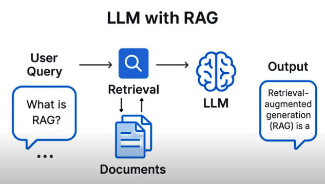

# Description

We have a user prompt and before we feed it to the LLM, we go against a vector DB (retrieval) and we’re going to do a semantic search against our corpus (private documents or more up-to-date info). We’re goingbto retrieve documents via a vectorDB search and combine it into our prompt and feed that to our LLM and then the LLM is going to use both our original prompt and this retrieved info and generate a user response.

# Steps

First let's create a Resource group:

The create a storage account in the same resource group:

Rest of parameters as default

Let’s create a container and go to Kaggle Netflix Movies and TV Shows and download the csv file and this what we’re going to place in our storage container in Azure:

Now create the storage account where we’re going to store our data. We’re going to create it in a container:

Now let’s create an AI Foundry resource in the same resource group:

Rest of paramters as default

Go to AI Foundry portal. Deploy base model and select model text-embedding-3-large

Go to AI service and Create a search service:

Import and vectorize data, Azure Blob storage, RAG:

Rest of parameters as default

Go to chat playground, model catalog, gpt-4o:

Select data source, azure blob storage

In Data connection, get API key

# Results

Now go to chat playground and ask a question. then check it in the csv file

and the recommendations are inside the csv file! It works!!

We try with another example:

Let’s check in the csv:

And it's there too! Amazing!!
